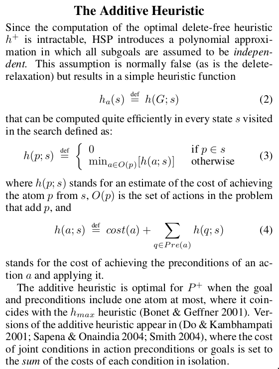

# ai-planning
Master Thesis in AI Planning

## Latest results

| Alg                        | Not found per timelimit |
| -------------------------- | ----------------------- |
| random                     | 1123                    |
| greedy                     | 1076                    |
| greedy + pruning           | 1714                    |
| hmax + lookahead           | 9199                    |
| backward propagation (min) | 851                     |
| backward propagation (max) | 1403                    |
| backward propagation (sum) | 1535                    |

- random =  [0.09874355670103092, 0.09916237113402061, 0.10293170103092783, 0.1047680412371134, 0.10795747422680413, 0.11556056701030928, 0.11900773195876288, 0.1443943298969072, 0.1911082474226804, 0.2592461340206186, 1.0]
- greedy =  [0.15625, 0.1566688144329897, 0.1647229381443299, 0.1709729381443299, 0.17922036082474227, 0.18563144329896908, 0.18846649484536082, 0.19893685567010308, 0.21701030927835052, 0.28137886597938144, 1.0]
- greedy + pruning =  [0.23856314432989692, 0.23985180412371135, 0.25035438144329897, 0.2578286082474227, 0.26510953608247423, 0.27197164948453606, 0.28144329896907216, 0.29790592783505154, 0.33324742268041235, 0.41945876288659795, 1.0]
- hmax + lookahead =  [0.2259987113402062, 0.2271262886597938, 0.23727448453608246, 0.24442654639175257, 0.2521262886597938, 0.25776417525773193, 0.2680090206185567, 0.2850193298969072, 0.31894329896907214, 0.3977448453608247, 1.0]
- backward propagation (min) =  [0.2534471649484536, 0.2543492268041237, 0.26549613402061856, 0.2730992268041237, 0.28031572164948454, 0.2860824742268041, 0.30422036082474224, 0.3292525773195876, 0.38234536082474224, 0.49693943298969073, 1.0]
- backward propagation (max) =  [0.2357603092783505, 0.23669458762886597, 0.24532860824742267, 0.25399484536082473, 0.2622744845360825, 0.2688144329896907, 0.2821520618556701, 0.30209407216494844, 0.35148195876288657, 0.46124355670103095, 1.0]
- backward propagation (sum) =  [0.23505154639175257, 0.2357603092783505, 0.24420103092783504, 0.25161082474226804, 0.25950386597938147, 0.2674935567010309, 0.2800257731958763, 0.2995811855670103, 0.3426224226804124, 0.450354381443299, 1.0]

## 0-0.3 vs 0.3-0.7 vs 0.7-1
- 0-0.3 =  [0.22767396907216494, 0.22838273195876288, 0.2400451030927835, 0.2486791237113402, 0.25876288659793817, 0.2658505154639175, 0.27963917525773196, 0.3011275773195876, 0.3512242268041237, 0.4655605670103093, 1.0]
- 0.3-0.7 =  [0.2351159793814433, 0.23556701030927835, 0.24606958762886597, 0.2551546391752577, 0.2674935567010309, 0.27767396907216496, 0.29068943298969074, 0.31278994845360825, 0.36349871134020617, 0.48112113402061857, 1.0]
- 0.7-1 =  [0.2293492268041237, 0.23073453608247424, 0.24213917525773196, 0.25357603092783504, 0.2647229381443299, 0.2819909793814433, 0.29594072164948454, 0.321423969072165, 0.37306701030927836, 0.49210695876288657, 1.0]

## backward propagation (min) vs 0.7-1 (instances solved by both)
- backprop_min =  [0.26062520784835386, 0.26158962421017623, 0.2729963418689724, 0.2807116727635517, 0.2885600266045893, 0.2949118722979714, 0.31330229464582643, 0.3395743265713336, 0.39437978051213834, 0.5129697372796808, 1.0]
- 0.7-1 =  [0.23674758895909545, 0.2381775856335218, 0.24995011639507816, 0.26175590289324907, 0.27326238776188894, 0.2910874625872963, 0.3054871965414034, 0.3317924842035251, 0.3851014299966744, 0.5079813767874959, 1.0]

## backward propagation (min) vs 0.3-0.7 (instances solved by both)
- backprop_min =  [0.2568417530946805, 0.25781197724991634, 0.26928738708598193, 0.27704918032786885, 0.28494479759116764, 0.29133489461358314, 0.30983606557377047, 0.3362663098026096, 0.3914018066242891, 0.5107059217129475, 1.0]
- 0.3-0.7 =  [0.24416192706590834, 0.2446303111408498, 0.25553696888591504, 0.26497156239545, 0.277785212445634, 0.28835731013716964, 0.3018735362997658, 0.32482435597189696, 0.37748410839745733, 0.4996319839411174, 1.0]

## pruning vs lookahead (instances solved by both)
- pruning =  [0.3091685393258427, 0.31096629213483146, 0.32507865168539324, 0.3353707865168539, 0.34638202247191013, 0.35591011235955056, 0.3692134831460674, 0.392, 0.44035955056179776, 0.553438202247191, 1.0]
- lookahead =  [0.31519101123595505, 0.31680898876404495, 0.3306067415730337, 0.33968539325842695, 0.3510112359550562, 0.3599550561797753, 0.3743370786516854, 0.3978876404494382, 0.44507865168539323, 0.5573483146067416, 1.0]

## pruning vs lookahead
- pruning =  [0.23824097938144329, 0.23952963917525774, 0.24964561855670103, 0.25702319587628863, 0.26491623711340206, 0.27222938144329895, 0.28176546391752577, 0.29816365979381443, 0.33334407216494844, 0.42094072164948454, 1.0]
- lookahead =  [0.22593427835051547, 0.22709407216494845, 0.23698453608247422, 0.2434922680412371, 0.25161082474226804, 0.2580219072164949, 0.2683311855670103, 0.28521262886597937, 0.3190399484536082, 0.3995167525773196, 1.0]
